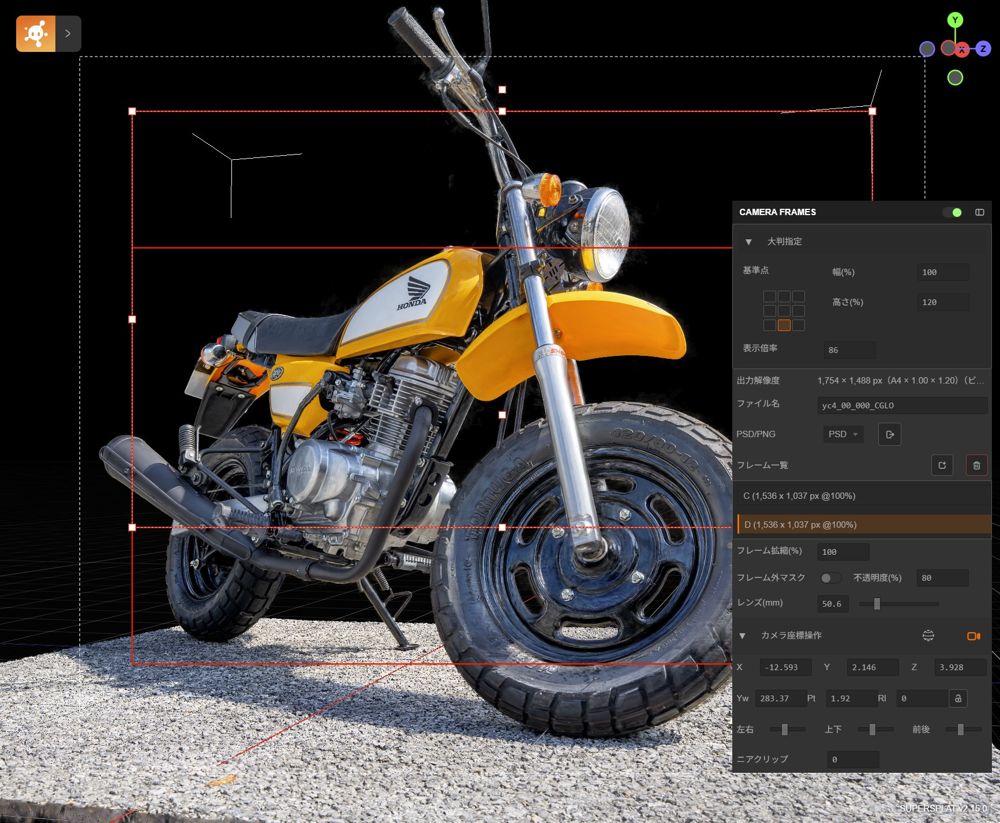

## Camera Frames



This repository adds the Camera Frames to SuperSplat. Camera Frames is the composition-safe camera workflow for renders. It keeps a reference render box anchored while you zoom the UI, preview extra scene area, and export matching images.

- Anchor-locked render box scaling (3×3 anchors) with off-axis frustum and horizontal FOV lock so composition survives viewport or aspect changes.
- View zoom (25–100%) shrinks the on-screen render box and extrapolates the frustum to reveal surrounding 3D content without letterboxing; viewport resize keeps the render-box center stable in screen space.
- Camera navigation swaps between FPV and Orbit modes, with numeric controls for position/rotation, roll lock to keep the optical axis level, and near-clip tuning to protect close shots.
- Multiple labeled frames with per-frame scale/rotation/pivot, ordering, and an optional mask that dims everything outside the union of frames for layout checks.
- Exports use the render-box dimensions at zoom 100%, so PNG/PSD output matches the preview; PNG embeds the red strokes with 150 PPI metadata, PSD includes the base render plus outline layers grouped by frame labels.
- Full Camera Frames Features: see [CameraFramesFeatures_en.md](./docs/CameraFramesFeatures_en.md)

### Camera Frames 日本語概要

このリポジトリは、SuperSplat に Camera Frames ワークフローを追加した派生版です。構図を崩さずにプレビューと書き出しを一致させるためのカメラ機能をまとめています。

- 用紙サイズを3×3 アンカー基点で調整可能。大判の用紙サイズ設定ができます。
- 表示倍率 25–100% で 大判時に全体をプレビューできます。
- 複数の撮影フレームを配置し、それぞれスケール・回転・移動できます。Photoshopの変形操作と同様にAltで基点指定できます。
- カメラをOrtbiとFPVで切り替えられます。数値入力によるカメラ制御可能、光軸ロール、ニアクリップも対応しています、
- フレーム外だけを暗くするマスクを備えたレイアウト確認。
- 書き出しはA4/150dpi相当のピクセル数を用紙サイズに合わせて大判にして出力できます。出力はPNGまたはPSD。PSD時は背景画像とフレーム枠でレイヤー分離。
- 詳細な機能説明は [CameraFramesFeatures.md](./docs/CameraFramesFeatures.md) を参照してください。


# SuperSplat - 3D Gaussian Splat Editor

[](https://github.com/playcanvas/supersplat/releases)
[](https://github.com/playcanvas/supersplat/blob/main/LICENSE)
[](https://discord.gg/RSaMRzg)
[](https://www.reddit.com/r/PlayCanvas)
[](https://x.com/intent/follow?screen_name=playcanvas)

| [SuperSplat Editor](https://superspl.at/editor) | [User Guide](https://developer.playcanvas.com/user-manual/gaussian-splatting/editing/supersplat/) | [Blog](https://blog.playcanvas.com) | [Forum](https://forum.playcanvas.com) |

SuperSplat is a free and open source tool for inspecting, editing, optimizing and publishing 3D Gaussian Splats. It is built on web technologies and runs in the browser, so there's nothing to download or install.

A live version of this tool is available at: https://superspl.at/editor


To learn more about using SuperSplat, please refer to the [User Guide](https://developer.playcanvas.com/user-manual/gaussian-splatting/editing/supersplat/).

## Local Development

To initialize a local development environment for SuperSplat, ensure you have [Node.js](https://nodejs.org/) 18 or later installed. Follow these steps:

1. Clone the repository:

   ```sh
   git clone https://github.com/playcanvas/supersplat.git
   cd supersplat
   ```

2. Install dependencies:

   ```sh
   npm install
   ```

3. Build SuperSplat and start a local web server:

   ```sh
   npm run develop
   ```

4. Open a web browser tab and make sure network caching is disabled on the network tab and the other application caches are clear:

   - On Safari you can use `Cmd+Option+e` or Develop->Empty Caches.
   - On Chrome ensure the options "Update on reload" and "Bypass for network" are enabled in the Application->Service workers tab:

   

5. Navigate to `http://localhost:3000`

When changes to the source are detected, SuperSplat is rebuilt automatically. Simply refresh your browser to see your changes.

## Localizing the SuperSplat Editor

The currently supported languages are available here:

https://github.com/playcanvas/supersplat/tree/main/static/locales

### Adding a New Language

1. Add a new `<locale>.json` file in the `static/locales` directory.

2. Add the locale to the list here:

   https://github.com/playcanvas/supersplat/blob/main/src/ui/localization.ts

### Testing Translations

To test your translations:

1. Run the development server:

   ```sh
   npm run develop
   ```

2. Open your browser and navigate to:

   ```
   http://localhost:3000/?lng=<locale>
   ```

   Replace `<locale>` with your language code (e.g., `fr`, `de`, `es`).

## Contributors

SuperSplat is made possible by our amazing open source community:

<a href="https://github.com/playcanvas/supersplat/graphs/contributors">
  
</a>
