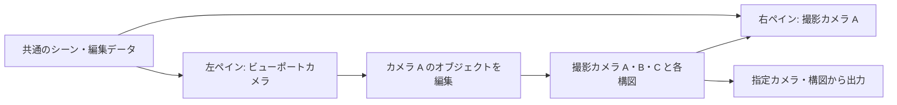

# v3移行: 本家との境界と複数カメラ・画面分割

更新日: 2026-09-12。[最初の実証](refactor-v3-first-proof.md) 後のユーザー要件を、次の実装の設計条件として整理する。本書の複数カメラ管理と分割ビューは設計段階であり、追加のGPU実証を済ませたものではない。

## 移行の目標

- 本家の標準機能で満たせる箇所を採用し、独自のEngine内部変更・shader差し替え・回避処理を減らす。
- 撮影カメラを独立したシーンオブジェクトとして安全に複数保持し、切替・編集・Undo・保存で姿勢と構図を維持する。
- 自由に観察・編集するビューポートカメラを、撮影カメラとは別に持つ。
- 同じシーンを、ビューポートカメラと撮影カメラで同時に表示・編集できる画面分割を実現する。
- この目的に必要なUIを段階的に追加する。既存UI全体の刷新やSpark版の変更は対象に含めない。

## 本家に持つ変更を絞る

PlayCanvas Engineは配布パッケージと標準APIを基本にする。SuperSplat Editor側の接続は、確定viewの受渡し、出力pass、独自データ保存の境界へ集める。撮影カメラ管理・構図・PSD・旧形式importはアプリ側の機能として実装する。

| 現行で独自に行っていること | v3での扱い | 現時点の根拠・条件 |
| --- | --- | --- |
| `calculateProjection` と `_projMatDirty` による非対称投影 | 標準FOV/aspect/`projectionOffset`へ置換 | 片側拡張・preview/outputは実証済み |
| 複数Splatのmerged描画、全量CPU backing data | 本家resource/instancesとGPU投影・sortへ移行 | 小素材の前後関係・編集・共有resource保存は実証済み |
| Engineの `gsplatCenterVS` 差し替え | 旧経路のコードを自動的に持ち込まない | 断面・near clip・正射影等の要求ごとにv3標準動作を検証し、必要な差分だけ判断する |
| GLB遮蔽用の独自出力 | アプリ側の追加passとPSD処理にまとめ、本家のSplat投影・alpha合成を再利用 | 単純な不透明GLBの元画像とマスク分離は実証済み |
| 出力時のcamera/targetの一時切替 | 明示的なviewとtargetを受け取る描画境界へ移行 | 実証ではtarget寸法の修正が必要だった。分割ビューでも検証する |

独自差分には「必要な製品機能」「本家に対する不具合修正」「移行中の仮接続」の理由を記録し、混ぜて保守しない。本家へ還元できる修正は分離可能な差分とし、上流で解消した際に撤去できるようにする。公開・PR送信は別途の作業とする。

独自改変を減らすことと、複数の責務をひとつのグローバル状態へ押し込むことを混同しない。少数の明示的な引数・接続点で安全性を確保する方針を優先する。

## 撮影カメラと操作状態の正を分ける

現行の `CameraPreset` はworld transformと `cameraFramesState.mainCameraPose` を持ち、実行中にも `viewportPoseRuntime`、world距離、viewport FOVを退避・復元する。`CameraPoseSnapshot` はorbitの角度・注視点・正規化距離を含む。複数の表現の同期が必要な構造である。

新設計では撮影カメラのworld positionとQuaternionを姿勢の正とする。Engine Entityはそのデータを反映する描画・gizmo用の表現とし、独立したもうひとつの保存元にしない。以下は責務名であり、最終的な型名やファイル配置の指定ではない。

| 責務 | 保持する状態 | 主な更新経路 |
| --- | --- | --- |
| 撮影カメラ | 永続ID・名前・position・Quaternion・レンズ/投影・clip条件 | カメラを対象にした編集コマンド |
| 出力構図 | 撮影カメラへの参照・基準画像窓・出力寸法・拡張アンカー・Frame群 | 構図編集コマンド |
| ビューポートカメラ | 独立した姿勢・投影と、orbit/flyのpivot・減衰等の操作状態 | そのビューポートのナビゲーション |
| ビューポート | ペインID・表示するカメラ/構図の参照・矩形・preview倍率/pan・補助表示 | ペインの表示操作 |
| 確定view | 姿勢・投影・clip・描画寸法・gate・CSS/DPR変換・描画設定・revision | 上記状態から導出。描画・pick・gizmo・参照画像・出力へ渡す |

レンズと構図から標準projectionOffset等を導出する。元のFOV、派生FOV、shift、投影行列を独立した編集可能データとして重複保存しない。既存の焦点距離表示・画角軸はimport時に照合して意味を保持する。

撮影姿勢をsceneRadius・モデル数・viewport寸法から復元しない。FOV変更、フレーム拡張、画面リサイズは、撮影位置を動かす操作として扱わない。orbit/flyの切替時は現在のworld姿勢から操作用の状態を作る。

カメラ切替はペインの参照先変更とする。旧カメラの姿勢を退避して新カメラへ上書きする手順にはしない。名前・配列の位置・現在選択されているペインを、カメラの同一性として使わない。

## 分割ビューでの編集

最初のUIは2ペインとする。左は自由に動くビューポートカメラ、右は選択した撮影カメラの構図を表示する。データ構造はペインIDとカメラ参照で持ち、左右専用のカメラ実装を作らない。

- 左をorbit/flyしても、撮影カメラA/B/Cの姿勢と出力は変わらない。
- 左で撮影カメラAのオブジェクトを移動・回転すると、右の撮影画像に反映する。
- 右でも、そのペインからのpick・gizmoを使ってシーンを編集できる。
- 右のpreview倍率・panは見方だけを変更する。撮影カメラを動かす操作は、対象が明示された撮影操作として分ける。ロック表示等の具体的なUIは次の実証で決める。
- 右をAからBへ切り替えてもAの状態は変わらない。出力対象はカメラIDと構図IDで指定し、フォーカスのあるペインから暗黙に決定しない。

シーンの選択対象、入力先のペイン、ペインが見るカメラ、出力対象のカメラを区別する。操作開始時にペインIDと確定viewを捕捉し、別ペインへの移動やカメラ切替によって、ドラッグや非同期pickの対象が入れ替わらないようにする。

## v3の描画基盤に追加で必要な境界

固定v3.0.0の `ProjectedSplatRenderer.render()` は `scene.camera` と `scene.targetSize` を参照し、投影texture、sort結果、indirect draw slot、materialをrenderer内に保持する。pickerも `scene.camera` と同じrendererを使用する。今回の単一view実証だけでは、2台のEngineカメラを追加して同時描画できることを確認していない。

次の実証では、viewとtargetを明示した描画入口を作り、まず各viewの「投影→sort→描画」を順番に完了させ、結果textureを各ペインへ表示する。GPU上でも前viewの描画が作業バッファを参照している間に次viewが上書きしないことを確認する。pickと出力も同じ契約に接続する。

保存する撮影カメラの数と、同時描画するviewの数を分ける。非表示カメラごとにSplatデータや重い描画資源を複製しない。Splatのsource/instancesは共通に持ち、表示viewに必要なtarget・投影/sortの作業領域を管理する。直列実行での再利用が成立するかを先に検証し、view別キャッシュの追加は必要性とメモリ費用を測って判断する。

`scene.camera` をグローバルに差し替えて個々の処理が暗黙参照する構造を、新しい公開契約にしない。特にpicker、footprint、参照画像、補助線のどれかだけが別viewを使用する状態を許さない。

## 安全性の受入条件

| 操作 | 維持すべきこと |
| --- | --- |
| A/Bを繰り返し切替、同じカメラを異なる倍率で表示 | world姿勢・出力構図が変化せず、表示操作が他ペインへ漏れない |
| 位置0、真上/真下、roll、FOV変更、シーンbound変更 | 有効な0値とQuaternionを保持し、切替で撮影位置を動かさない |
| カメラ作成・複製・削除・Undo/Redo・保存再読込 | 永続IDと参照が整合し、複製後の片側編集が元へ伝播しない。削除したカメラへの参照を宙に浮かせない |
| 分割のリサイズ、DPR変更、片側のみzoom/pan | 各ペインの描画・pick・gizmoが同じ座標変換を使い、出力は変わらない |
| pick/readback中のカメラ切替・削除・再読込 | requestの対象ID・view/scene revisionを照合し、古い結果を新しい状態へ適用しない |
| カメラ編集中の中断、描画失敗、Undo | 操作をひとつのtransactionとして確定/取消しでき、半端な姿勢やprojectionを残さない |
| プレビュー表示中のPNG/PSD出力 | 指定カメラ・構図のsnapshotを使用し、途中のUI変更が出力に混ざらない |
| 複数ペインで同じSplat/GLBを編集 | データと履歴を共有しつつ、投影・遮蔽・選択表示は各viewで正しい |

ビューポート配置や最後の観察姿勢は作業状態として復元可能にするが、撮影データの保存・Undoと所有権を分ける。保存中の編集中データの扱いと旧形式の意味変換は、互換adapterとfixtureで明示的に検証する。

## 次の実装順

1. 今回の `ShotCamera` / `FrameComposition` / 確定viewを基に、複数カメラのID管理・編集コマンド・Undo・保存と、独立したビューポートカメラを作る。
2. 隔離環境で2ペインの表示・入力・pick・gizmo・出力を通す。単一viewの既存試験と合わせ、GPU作業領域の寿命とメモリ増加を確認する。
3. この境界を使ってv3のresource/instances・renderer・編集・保存を本統合し、旧形式importを接続する。実証用の文字列置換スクリプトを製品の拡張方式にはしない。
4. 参照画像、GLB/PSDの残り、断面、旧カメラ/timeline等を段階的に接続する。機能ごとの回帰試験を通して不要になった旧回避処理を撤去する。

分割ビューを後付けする前提で単一グローバルcameraへの依存を広げない。次の小さな実証に複数カメラと2ペインを含め、本統合の境界を先に固める。

## 確認したコード

- [現行のカメラ型](../src/camera-frames-types.ts)、[撮影/viewport姿勢の切替](../src/camera-frames.ts)、[orbit/FPVと距離の復元](../src/camera.ts)。
- [現行のprojection差し替え](../src/camera-frames-camera-integration.ts)、[Engine shader chunkの差し替え](../src/splat-render-backend.ts)。
- [実証の確定view](../experiments/v3/src/render-view.ts)、[標準APIへの適用](../experiments/v3/src/apply-view.ts)、[実証用接続箇所](../experiments/v3/setup.mjs)。
- ローカルGitにある本家 `v3.0.0 / 12398f7f6997bd59bdd82876fd90fc87a6ec6f68` の `src/projected-splat-renderer.ts`、`src/picker.ts`、`src/camera.ts`、`src/scene.ts`。比較用展開先 `.v3-proof/baseline/` で確認した。
