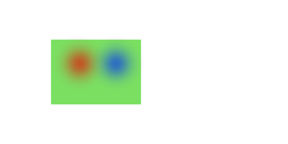
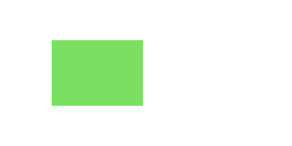
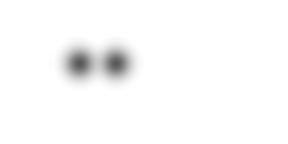
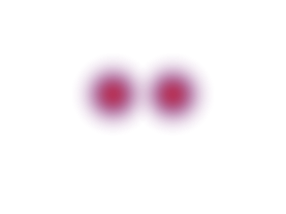
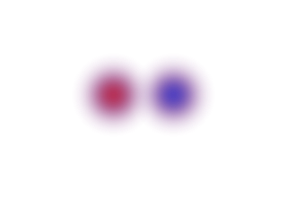

# SuperSplat v3 最初の実証結果

実施日: 2026-09-12。前提は [引き継ぎ](refactor-v3-handoff.md) と [詳細調査書](upstream-v3-refactor-investigation-2026-09-09.md)。

## 結果と位置づけ

**固定したv3.0.0基盤上で、最初の実証の最小合格条件を通過した。** 複数Splatの前後関係、position/Quaternionの撮影姿勢、標準レンズシフトの右側拡張、選択・編集・保存再読込、単純なGLBのPSDマスクを、実際のWebGPU描画と生成物で検証した。

本統合前の隔離実証であり、現行アプリのrenderer・UI・保存形式を置き換える変更ではない。コードは `experiments/v3/`、固定した本家の展開先はignoreされた `.v3-proof/`。既存の `src/`、runtime依存、Spark版は変更していない。

| 基準 | コミット / 依存 |
| --- | --- |
| 作業起点 | `camera-frames` の文書込み `677b3d21ea2168d671c02113ab19654f70c1df30` |
| 作業ブランチ | `codex/v3-first-proof` |
| 本家 | `v3.0.0` / `12398f7f6997bd59bdd82876fd90fc87a6ec6f68` |
| 実証版 | PlayCanvas 2.22.0、splat-transform 3.3.3、PCUI 6.1.4 |
| 現行比較 | PlayCanvas 2.17.0、splat-transform 1.8.2、PCUI 5.8.0 |
| 実機 | Windows、Chrome 152、NVIDIA Blackwell、WebGPU。本GPUのWebGL識別はRTX 5080 |

`AGENTS.md` は元フォルダのローカルファイルを使用し、展開先にもコピーした。すべてignore対象のままでコミット対象に含めていない。素材は合成データで、私的な `test/` のファイルを使っていない。

## 実装した境界

`ShotCamera` はworld positionと正規化Quaternionを持つ。`FrameComposition` は元の出力寸法・拡縮・アンカー、previewは描画面とraw gateを持つ。`resolveView` がそれらから変更不可のスナップショットを生成し、camera、picker、画面・offscreen出力が同じ確定viewを使用する。

Engineの `horizontalFov=false`、aspect、縦FOVまたはorthoHeight、`projectionOffset` に接続した。独自projection callbackは追加していない。撮影viewが有効な間はorbitの更新を適用せず、`sceneRadius` やFOVから撮影位置を再構築しない。通常の操作カメラを撮影姿勢の保存形式にしていない。

本家の `EditorSplatResource` / `GaussianInstances`、GPU投影・sort・draw、picker、編集history、version 1保存を使う。共有resourceと個々のinstanceの所有権を維持し、旧merged経路のCPU配列を裏側に残していない。

本家の保存データには実証用 `extensions.cameraFramesProof.version=1` を追加し、撮影姿勢・構図とGLBバイナリを同じZIPへ格納する。この拡張は製品の保存仕様ではない。旧形式との互換を主張するものでもない。

## 検証結果

数値試験はNode上、GPU試験はChrome上で実行した。画素誤差は8bit premultiplied RGBAの値域0〜255で測り、最大値は1チャネルの差を表す。

| 対象 | 実際に確認した内容 | 結果 |
| --- | --- | --- |
| 標準レンズシフト | 現行の関数を抽出して9アンカー・縦横3倍率・透視/正射影162組とEngine 2.22の実投影行列を照合 | 合格 |
| preview数式 | 現行fit/zoom/pan/raw gate、zoom 50/100/175%、DPR 1/1.25/2、透視/正射影 | 合格 |
| 合成素材 | 本家の実loaderでbinary PLYのFloat32座標・SH色・opacityを照合 | 合格 |
| 複数Splat | 2 PLY・各2 Gaussian。左は赤、右は青を前面にし、個別描画から求めたalpha-overと比較 | 最大誤差0.746以下 |
| 片側拡張 | 320×240から右へ480×240。左320×240を基準画像と比較 | 最大1、平均0.002728 |
| preview/output | 640×480のpreview内、(51,37)の480×240を出力と比較 | 最大1、平均0.005451 |
| 撮影姿勢 | 位置0、真上/真下、roll 37度、yaw 180度、FOV変更、sceneRadius=10000、別カメラからの復帰 | 姿勢保持、復帰画像差0 |
| GPU pick・編集 | フレーム描画前のview切替、ID pick、選択Undo/Redo、共有resourceの複製、片側の削除Undo/Redoとtransform | 合格 |
| GLB前後 | GLBより奥の青Splatのalpha=0、手前=166。GLB深度で制限したSplat alphaを使用 | 合格 |
| GLB合成 | `front + GLB * (1 - frontAlpha)` と通常の合成描画 | 最大2、平均0.026582 |
| PSD | 未遮蔽GLB元画像と独立マスクをag-psdで書き、再読込して画素照合 | 元画像・マスクとも差0 |
| 保存再読込 | 本家v1、resource 2、layer 3、選択flags・palette・transform・可視状態、共有resource、撮影構図・GLB | 再描画差0、ZIP 4,622 bytes |
| 画面/offscreen | 1445×1794の画面用main targetと、同じviewのoffscreen targetを比較 | 画素差0 |
| WebGPU検証 | `uncapturederror` を監視 | エラー0 |

PSDはPhotoshop等での手操作ではなく、ag-psdによるバイナリ往復とChromeでの元画像・マスクの目視確認まで。出力したPSDは後続のDCC検証にも使用できる。

生の数値は [実GPU結果](assets/v3-proof/report.json)、比較計測は [比較結果](assets/v3-proof/comparison.json) を参照。画像はすべて共有可能な合成素材から生成した。

## GLBマスクの成立条件

対象は不透明な矩形GLB 1個、sorted描画、MSAA 1。GLBの深度と同じattachmentを使い、カラーとalphaだけを透明にclearしてから本家Splat passを実行する。Splatはdepth testあり・depth writeなしなので、GLBより手前のalpha合成だけが残る。

マスクは `T = 1 - A`。元画像はGLBだけを描いた未遮蔽のstraight RGBAとして別に保持する。元画像のalphaをマスクへ二重に掛けない。grid・背景・選択色・centers・gizmoはマスクのpassに含めない。

PSDは「GLB元画像＋その遮蔽マスク」と、非表示の合成参照画像を持つ。全SplatとGLBを一般的なレイヤーに分解して、PSD全体を任意順に再合成できるという実証ではない。交差するレイヤー、複数GLB間のvisibility、alpha-test/半透明材質、MSAA、輪郭AAは次段階に残る。

## 実装中に確認した境界と修正

- 本家rendererの投影処理が `scene.targetSize` を参照していた。offscreenのcamera targetが異なると画像寸法と投影寸法が食い違うため、実証では `camera.targetSize` に変更した。画面・preview・出力の一致試験はこの修正を含む。選択footprintのoffscreen経路は未実証。
- view更新からGPU readbackまでを本家のcommand queueで直列化し、指定passのpostrender後にreadbackする。旧版の「数フレーム待つ」出力手順を移植していない。WebGPU readbackは上下反転なし、比較用WebGLのみ反転する。
- 初期のASCII合成PLYがsplat-transform 3.3.3の `readPly` で意図した値にならなかったため、合成素材をbinary little endian Float32へ変更し、loader値照合を追加した。不正な初期素材による画像は採用していない。本家ASCII対応の改修は今回の対象外。
- 本家のESLint 10.10とeslint-plugin-import 2.32の組合せでは `sourceCode.getTokenOrCommentAfter` の例外が発生した。runtime依存を変えず、親lockfileのESLint 9と設定で本家を含む実証ソース全体を検査するようにした。

## 比較の範囲

現行merged、現行unified-display、本家v3、実証版を、同じ合成4 Gaussian・320×240・SH0・linear・world位置 `(0,0,5)` で測る。旧版は撮影フレームを無効にした編集カメラ、本家素の状態はorbit、実証版はposition/Quaternion cameraを用いる。各カメラのclip面を含む実際の投影行列もJSONへ記録する。

GPU時間とupdate完了後〜postrenderのCPU時間を60フレーム記録し、先頭15を除く中央値・p95を取る。小素材ではGPU timestampの刻みや固定費の影響が大きい。初回表示時間、操作FPS、RAM/VRAM、1M/5M/10Mの性能比較は今回の結果に含めない。

| 対象 | CPU 中央値 / p95 (ms) | GPU 中央値 / p95 (ms) | 実証版との画素差 最大 / 平均 |
| --- | --- | --- | --- |
| 現行merged (WebGL2) | 0.700 / 1.000 | 0.011648 / 0.019904 | 99 / 0.592096 |
| 現行unified-display (WebGL2) | 0.700 / 0.900 | 0.010048 / 2.591968 | 8 / 0.308499 |
| 本家v3 (WebGPU) | 0.900 / 1.400 | 0.065536 / 0.131072 | 0 / 0 |
| 実証版 (WebGPU) | 0.800 / 1.100 | 0.065536 / 0.131072 | 基準 |

実証版と本家v3の画素は完全一致した。旧unifiedとの差は輪郭等を含め最大8階調。旧mergedでは、右側が青の手前になるべき場所でも赤が優勢になった。本家と現行unifiedでは左右の前後が切り替わっている。これは変更していない旧rendererとこの合成素材で観測した差で、今回のv3接続による回帰ではない。旧mergedの原因調査・改修は今回行っていない。

## 検査コマンドと再現手順

[実証README](../experiments/v3/README.md) にセットアップ、ビルド、GPU試験、比較、生成物の閲覧手順を記載した。

- `npm run lint` / `npm run build`: 現行アプリで成功。既存のSass/Browserslist/ag-psd・循環依存等の警告あり。
- `npm run lint:v3`: 成功。本家と実証の全TypeScript、実証用Nodeスクリプトを検査。
- `npm run test:v3`: 4件成功。
- `npm run build:v3`: 型チェックとビルド成功。
- 本家素の状態・現行版の比較用ビルド: 成功。
- Node 24の実証用CIを追加。リモートGitHub ActionsとLinux実行は未確認。CIにはGPU試験を含めない。

Windowsのこの環境では、隔離先のビルド書き込みにsandboxのEPERMが出たため、承認された権限昇格で実行した。アプリの実装不具合として扱っていない。

## 次の統合単位

実証後に追加された複数カメラ・分割ビューと保守方針は [カメラとviewの移行設計](refactor-v3-camera-and-views.md) を参照。単一viewへの依存を本統合で広げないよう、次の隔離実証に2ペインを含める。

この結果から、v3のresource/instances・renderer・編集history・picker・v1保存を整合する単位として取り込み、今回のview adapterと撮影カメラを接続する方向で進められる。最初に全UIを作り直す必要はない。

次のbatchの合格条件には、旧 `version=0 / schemaVersion=4` の最小import adapterと既存ファイルfixtureによる往復確認を含める。今回の独自拡張をそのまま最終保存形式にせず、resource共有と旧データの所有権を照合して仕様を確定する。

残る検証は、sourceRowを非自明に詰め直す保存とFloat32往復、通常UIでのgizmo/参照画像との一致、撮影カメラのシーンオブジェクト操作、旧 `.sscam`/camera preset/timeline、断面、複数GLB・透明材質・全PSD出力、150dpi、4GiB境界と保存失敗時の保全、実素材の性能、PWA更新。これらを済んだものとして本番を切り替えない。
